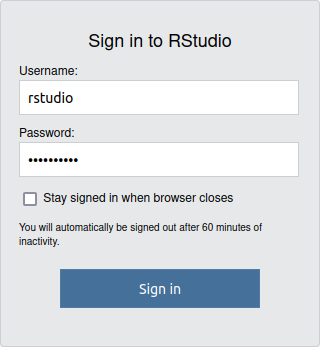
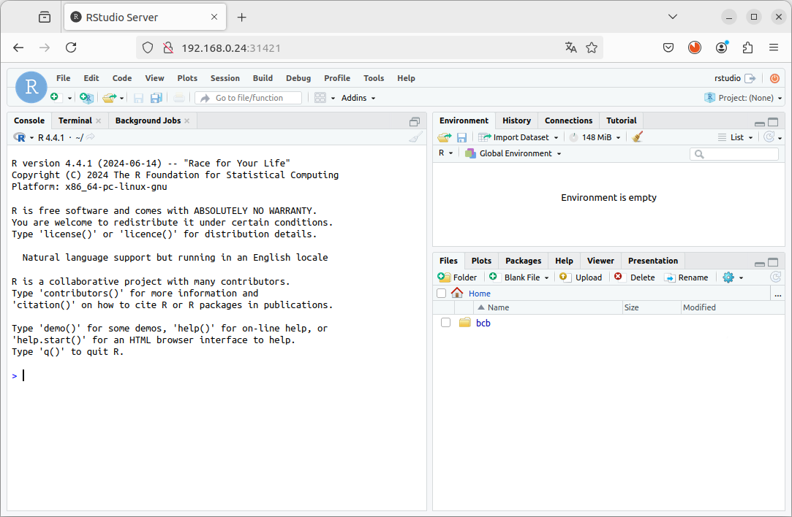
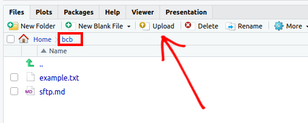
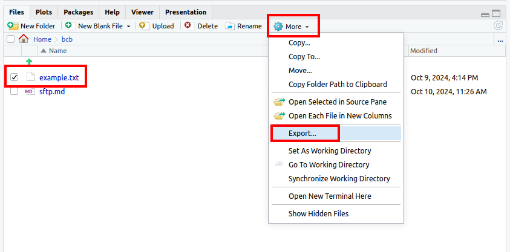
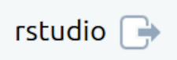

# How to Connect to RStudio Server

In this tutorial, we will guide you on how to connect to an RStudio Server using any web browser.

## Step 1: Open Your Web Browser
1. Launch any web browser of your choice (e.g., Chrome, Firefox, Safari, Edge).

	  <!-- Placeholder image URL -->

## Step 2: Enter the RStudio Server URL

1. In the address bar, type the URL of the RStudio Server you want to connect to. The URL format typically looks like this:

	```
	http://<hostname>:<port>
	```
	
	Replace `<hostname>` with the server's hostname or IP address and `<port>` with the port number (default is usually `8787`).

	**Example:**

	

## Step 3: Log in to RStudio Server

1. Once the RStudio Server page loads, you will be prompted to enter your credentials.
2. Enter your **username** and **password**.

	

3. Click the **Sign In** button to proceed.

## Step 4: Explore the RStudio Environment

1. After logging in, you will see the RStudio interface.

2. You can now create, edit, and manage your R scripts and projects.

	

## Step 5: Uploading and Downloading Files

### Upload Files
1. In the Files pane of RStudio, click the **Upload** button.
2. Choose the file(s) you want to upload from your local system and click **OK**.

	  <!-- Placeholder image URL -->

### Download Files
1. In the Files pane, select the file you want to download.
2. Click the **More** button and select **Export**.
3. Choose the destination on your local system and click **Save**.

	

**Note:** You can also upload files using SFTP by following the tutorial located at `/path/sftp.md`.

## Step 6: Important Note on File Persistence
Make sure to use the `bcb` folder for the persistence of files. This is crucial to ensure that your work is saved across sessions.

## Step 7: Sign Out

1. When you are finished, it's important to sign out out to protect your account.
2. Click on your username in the top-right corner and select **Sign out**.

	

## Conclusion

In this tutorial you have successfully connected to an RStudio Server from your web browser, uploaded and downloaded files, and ensured your work is saved properly.
