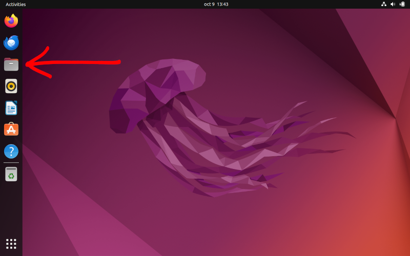
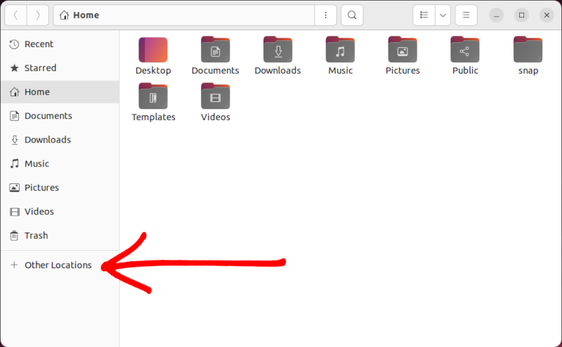
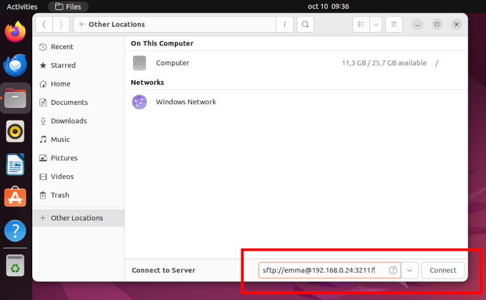
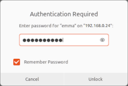
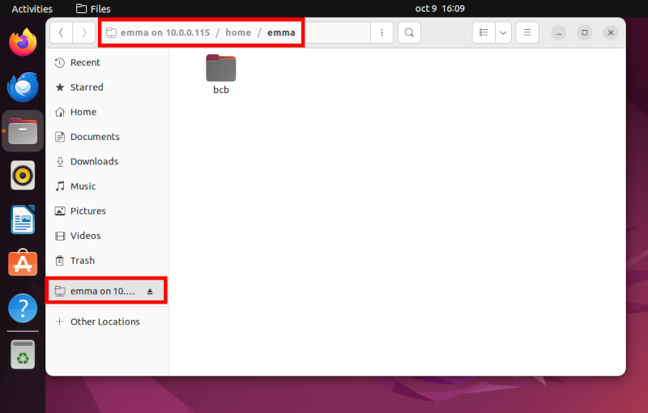
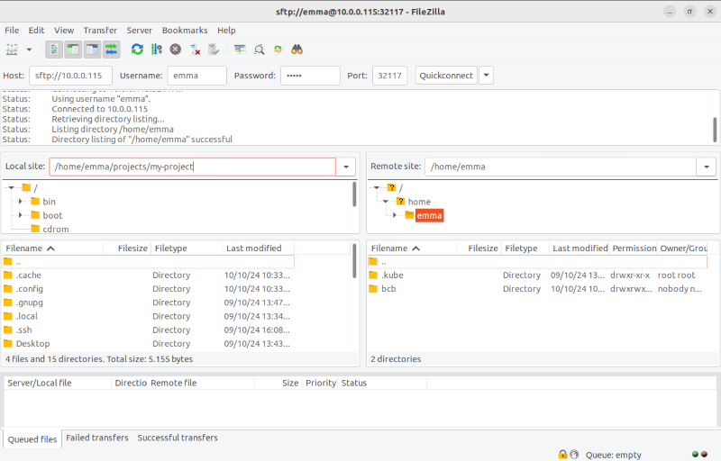
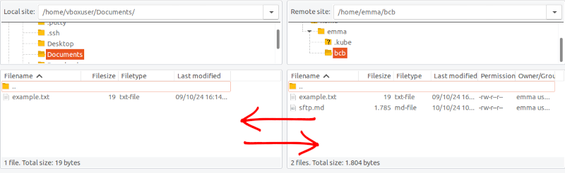
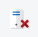

# Connecting to an SFTP Server

In this tutorial, you'll learn how to connect to an SFTP server using three methods: the file explorer (Nautilus) in Ubuntu 22.04, the Linux/Unix command line, and FileZilla. Each approach allows you to securely transfer files between your local machine and the SFTP server. Click on the method you'd like to learn more about:

- [Using Nautilus (Ubuntu)](#1-using-nautilus-ubuntu-2204)
- [Using the Command Line (Linux / Unix)](#2-using-the-command-line)
- [Using FileZilla (Linux / Mac OS / Windows)](#3-using-filezilla)
- [Using PowerShell (Windows 10 / 11)]()

Each section includes step-by-step instructions for connecting, transferring files, and navigating the server.


## 1. Using Nautilus (Ubuntu 22.04)

Nautilus, the default file manager for Ubuntu, allows you to connect to SFTP servers easily through a graphical interface. This method is ideal for users who prefer a visual approach to file management.

### Step 1: Open the File Explorer

1. Click on the **Files** icon in the left sidebar of Ubuntu (it looks like a folder).



### Step 2: Connect to the Server

1. In the bottom left of the file explorer window, click on **"Other Locations"**.



### Step 3: Enter the SFTP Server URL

1. In the dialog box that appears, enter the server URL in the format `sftp://username@hostname:port`. Replace `username`, `hostname`, and `port` with your details.

   **Example:**
   
   sftp://emma@192.168.0.24:32117



2. Click **Connect**.

### Step 4: Enter Your Password

1. A window will pop up asking for your password. Enter the password for the `lina` account and check the option to **Remember for this session** or **Remember forever** if you prefer.



2. Click **Connect**.

### Step 5: Browse Files on the Server

1. After successful authentication, the remote server will appear as a mounted drive in the left sidebar of the file explorer.
2. You can now navigate through the server's files just like you do with local files.

	**Note**: In the context of the cluster, you should see a folder named bcb. This folder corresponds to the persistent storage space available on the cluster. If you want to ensure that your data is not lost when the pods are terminated, you must upload your files to the bcb directory.



### Step 6: Upload/Download files

1. In order to upload and/or download files, you can drag and drop in both directions: from a folder on your local computer to the remote folder, and vice versa.


## 2. Using the Command Line

For those who are comfortable with the terminal, the command line offers a quick and efficient way to connect to an SFTP server. This method provides more control and is useful in remote or automated environments.

### Prerequisites

Before proceeding, make sure you have the following:

- Access to a Linux or Unix terminal.
- The hostname or IP address of the SFTP server.
- A valid username and password (or SSH key) for authentication.

### Step-by-Step Instructions

#### Step 1: Open the Terminal

On your Linux/Unix system, open the terminal. You can do this by pressing `Ctrl + Alt + T` or searching for "Terminal" in your applications menu.

#### Step 2: Connect to the SFTP Server

Use the `sftp` command to initiate a connection to the SFTP server. The basic syntax is:

```bash
sftp -oPort=<port> <username>@<hostname>
```

- Replace `username` with your SFTP account’s username.
- Replace `hostname` with the SFTP server’s IP address or domain name.

For example:

```bash
sftp -oPort=32117 emma@192.168.0.24
```

Once you press Enter, you'll be prompted to enter your password:

```bash
emma@192.168.0.24's password:
```

Type your password and hit Enter. If the login is successful, you will enter the SFTP prompt, which looks like this:

```bash
Connected to 192.168.0.24.
```

#### Step 3: Navigating the SFTP Environment

Once connected, you can navigate the SFTP server using commands similar to the regular Linux shell. Here are some basic commands you can use:

- **List files and directories:**

  ```bash
  ls
  ```
  
  **Note**: This command will display the contents of the current directory on the SFTP server. In the context of the cluster, you should see a folder named bcb. This folder corresponds to the persistent storage space available on the cluster. If you want to ensure that your data is not lost when the pods are terminated, you must upload your files to the bcb directory.

- **Change directory on the remote server:**

  ```bash
  cd bcb
  ```

- **Print the current directory path:**

  ```bash
  pwd
  ```
  
  This command will display the full path of the current working directory on the SFTP server. For example, when executed, it may show:
  
  ```bash
  Remote working directory: /home/emma/bcb
  ```

- **Change directory on your local machine:**

  ```bash
  lcd /home/emma/projects/my-project
  ```
  The lcd (local change directory) command is used to change the directory on your local machine. This is helpful when you want to specify the local folder where files will be downloaded from or uploaded to the SFTP server.

#### Step 4: Uploading Files to the Server

To upload a file from your local machine to the SFTP server, use the `put` command. For example:

```bash
put my-local-script.R
```

This command will upload the file from your local machine to the current directory on the server.

You can also upload multiple files at once:

```bash
mput file1 file2 file3
```

#### Step 5: Downloading Files from the Server

To download a file from the SFTP server to your local machine, use the `get` command:

```bash
get my-remote-script.R
```

This will download the specified file from the current directory on the server to your local machine.

For downloading multiple files, you can use the `mget` command:

```bash
mget file1 file2 file3
```

#### Step 6: Exiting the SFTP Session

When you're done, type the following command to exit the SFTP session:

```bash
bye
```

Or:

```bash
exit
```

This will close the connection and return you to your regular terminal prompt.

### Additional SFTP Commands

Here are a few more useful SFTP commands:

- **Create a directory on the server:**

  ```bash
  mkdir directory_name
  ```

- **Delete a file on the server:**

  ```bash
  rm file_name
  ```

- **Delete a directory on the server:**

  ```bash
  rmdir directory_name
  ```

- **Check file size:**

  ```bash
  ls -l
  ```

### Conclusion

You have now learned how to connect to an SFTP server via the command line, navigate the remote filesystem, upload and download files, and manage directories. The command line method offers flexibility and efficiency, especially for users who work in terminal-based environments or need to automate tasks. With this approach, you can easily manage files on your SFTP server.


## 3. Using FileZilla

FileZilla is a popular and easy-to-use graphical SFTP client that works on multiple platforms. Follow these steps to connect to your SFTP server using FileZilla.

### Step-by-Step Instructions

#### Step 1: Open FileZilla

Launch the FileZilla application on your computer. You should see the main interface with fields for entering connection details at the top.

#### Step 2: Enter Connection Details

At the top of the FileZilla window, fill in the following fields:

- **Host:** `sftp://192.168.0.24`
- **Username:** `emma`
- **Password:** [enter your password]
- **Port:** `32117`

Click **Quickconnect** to establish the connection. Your interface should look like this:


#### Step 3: Navigating Remote and Local Directories

Once connected, you will see two panels: 
- The left panel represents your **local machine** (where you can browse local files).
- The right panel shows the **remote server** (SFTP server) files.

You can navigate through your directories on both sides to find the files you wish to transfer.



#### Step 4: Transferring Files

To upload files to the server:
- In the left panel, browse to the local directory where your files are stored.
- In the right panel, navigate to the target directory on the server (e.g., `/home/emma/bcb`).
- Drag and drop files from the left panel to the right panel to start the upload.

**Note**: In the context of the cluster, you should see a folder named bcb. This folder corresponds to the persistent storage space available on the cluster. If you want to ensure that your data is not lost when the pods are terminated, you must upload your files to the bcb directory.

To download files, simply reverse the process—drag files from the right panel (server) to the left panel (local machine).



#### Step 5: Disconnecting

When you're finished transferring files, click the **Disconnect** button at the top of the FileZilla window to safely close the connection.



### Conclusion

You have now learned how to connect to your SFTP server using FileZilla, transfer files between your local machine and the server, and navigate both file systems.

# 4. Using Windows 10/11 (PowerShell)

If you're using Windows 10 or 11, you can easily connect to an SFTP server using the built-in PowerShell. This method does not require any additional software and is a simple way to access and manage files on an SFTP server from Windows.

### Step-by-Step Instructions

#### Step 1: Open PowerShell

1. Press `Win + X` and select **Windows PowerShell** or search for "PowerShell" in the start menu.
   
2. Once PowerShell is open, you'll see a command prompt window where you can enter commands.

#### Step 2: Connect to the SFTP Server

To connect to your SFTP server, use the following syntax:

```bash
sftp username@hostname
```

For our example:

```bash
sftp emma@192.168.0.24 -P 32117
```

This connects you to the server using the specified username and port. After pressing Enter, you will be prompted for your password.

```bash
emma@192.168.0.24's password:
```

Enter the password for your account to connect.

#### Step 3: Navigate the SFTP Server

Once logged in, you can navigate the server using basic SFTP commands such as:

- **List files and directories:**

  ```bash
  ls
  ```

- **Change directory on the server:**

  ```bash
  cd <directory_name>
  ```

- **Print the current directory:**

  ```bash
  pwd
  ```

#### Step 4: Uploading and Downloading Files

To **upload** a file from your local computer to the SFTP server, use the following command:

```bash
put <local_file_path>
```

For example:

```bash
put C:\Users\Emma\Documents\my-file.txt
```

To **download** a file from the server to your local machine:

```bash
get <remote_file_name>
```

For example:

```bash
get my-server-file.txt
```

#### Step 5: Disconnecting

To disconnect from the SFTP server, type:

```bash
exit
```

This will close your SFTP session and return you to the regular PowerShell prompt.

### Conclusion

You have now learned how to connect to an SFTP server from Windows 10/11 using PowerShell. This method provides a quick and easy way to manage files on your server without needing to install additional software.

### Summary

You have now learned how to connect to your SFTP server using FileZilla, transfer files between your local machine and the server, and navigate both file systems.

## Conclusion

You have successfully connected to your SFTP server using the file explorer on Ubuntu 22.04, the command line, and FileZilla. Now you can securely manage your files on the server, whether you prefer a graphical interface or the efficiency of the terminal. With these methods, you're equipped to handle file transfers in various environments.

