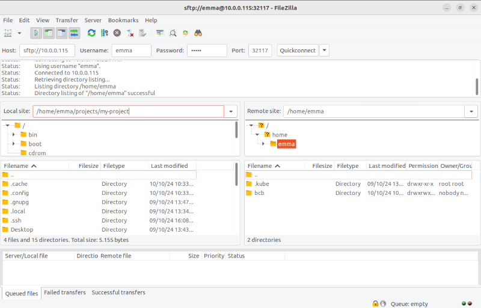
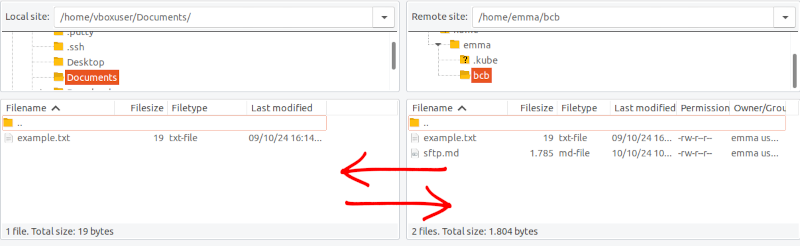
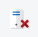

## 3. Using FileZilla

FileZilla is a popular and easy-to-use graphical SFTP client that works on multiple platforms. Follow these steps to connect to your SFTP server using FileZilla.

### Step-by-Step Instructions

#### Step 1: Open FileZilla
Launch the FileZilla application on your computer. You should see the main interface with fields for entering connection details at the top.

#### Step 2: Enter Connection Details

At the top of the FileZilla window, fill in the following fields:

- **Host:** `sftp://192.168.0.24`
- **Username:** `emma`
- **Password:** [enter your password]
- **Port:** `32117`

Click **Quickconnect** to establish the connection. Your interface should look like this:

#### Step 3: Navigating Remote and Local Directories
Once connected, you will see two panels: 
- The left panel represents your **local machine** (where you can browse local files).
- The right panel shows the **remote server** (SFTP server) files.

You can navigate through your directories on both sides to find the files you wish to transfer.

#### Step 4: Transferring Files
To upload files to the server:
- In the left panel, browse to the local directory where your files are stored.
- In the right panel, navigate to the target directory on the server (e.g., `/home/emma/bcb`).
- Drag and drop files from the left panel to the right panel to start the upload.

**Note**: In the context of the cluster, you should see a folder named bcb. This folder corresponds to the persistent storage space available on the cluster. If you want to ensure that your data is not lost when the pods are terminated, you must upload your files to the bcb directory.

To download files, simply reverse the process—drag files from the right panel (server) to the left panel (local machine).

#### Step 5: Disconnecting
When you're finished transferring files, click the **Disconnect** button at the top of the FileZilla window to safely close the connection.

### Conclusion
You have now learned how to connect to your SFTP server using FileZilla, transfer files between your local machine and the server, and navigate both file systems.
